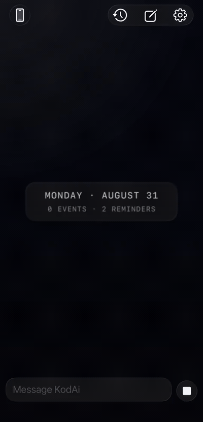
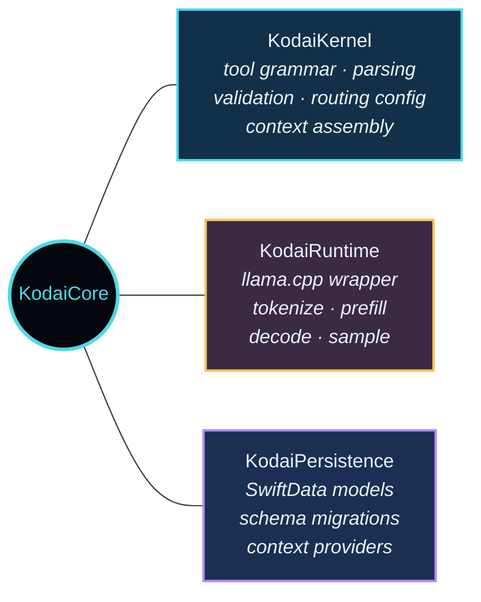
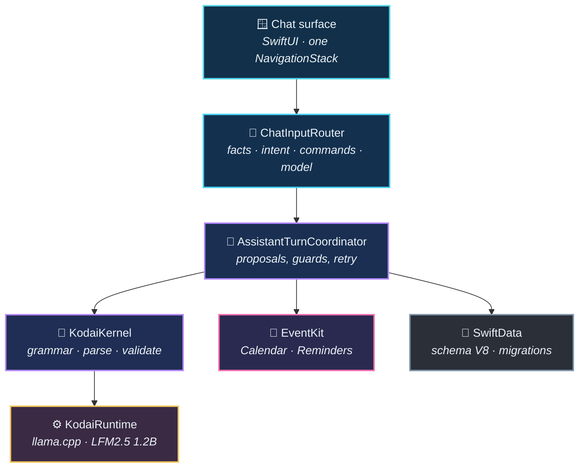

# KodAi

**A private assistant for iPhone that runs a 1.2B language model entirely on the device.**

*No cloud. No API keys. No network calls.*

 

Every step above runs on the phone. No server, no API key, no network.

---

## The problem

KodAi is an iPhone assistant with no server behind it. A 1.2B-parameter model ships inside the app bundle and runs through llama.cpp on the device's GPU. You talk to it normally; when you ask for something actionable it calls a tool, such as creating a Calendar event, adding a Reminder, or searching your local notes.

A 1.2B model is roughly a hundredth the size of the models that made tool-calling look easy. Left alone it emits malformed JSON, invents arguments, narrates instead of acting, and routes "show me my to-do list" into creating a to-do. Most of the work here is closing that gap. The output format is constrained at the sampler by a grammar built from the tool catalog, so an invalid call cannot be generated in the first place. Whatever gets through is checked by a validator that owns the semantics the grammar cannot express.

The next problem is not asking the model at all. Every message goes down the first of four routes that matches: a backend fact ("what time is it"), a pinned-tool intent ("remind me to…"), a slash command, or a full model turn. When the tool is already known, the model's job shrinks from picking one of six tools and filling its arguments to filling one schema, which a small model does more accurately.

Then there is the phone itself. Decoding runs off the main thread with a watchdog, paces when the device gets hot, and buffers output so multi-byte characters do not arrive as garbage mid-stream. Context is sized by device tier and budgeted per source, so no one part of the prompt crowds out the rest, and the app shows how full the window was on the last turn.

The last problem is being wrong safely. Every write the model originates is a proposal rather than an action: an editable card you confirm. One tool call per turn, no invented ids, questions never create, and time is resolved by code rather than trusted from the model. A failure gets one silent retry seeded with what went wrong, then a specific message about the field that was wrong.

---

## How it's built

`KodaiCore` is a standalone Swift package with three targets and no third-party dependencies:

That package is what unifies the two apps. They differ underneath: iOS runs llama.cpp with a bundled GGUF, macOS runs Apple Foundation Models with an optional Ollama backend. The runtime sits behind a protocol, and everything above it is shared, including the routing config, the parser and validator, context assembly, and persistence.

It also makes the evaluation harness meaningful. Labelled inputs run through the same shipped routing config the iPhone app uses, so there is no second copy to drift out of sync, and a regression in the app is a regression in the eval. It also lets 157 tests run without loading a 700 MB model.

Inside the iPhone app:

**Tool catalog (six).** `calendar_create_event`, `calendar_list_events`, `reminders_create`, `reminders_list`, `kotes_search`, `respond`. Read-only tools run automatically; the two creates go through the proposal sheet.

**Kotes** are the local knowledge base, plain notes with no relationships. The model can read them via `kotes_search` but has no write path.

**Privacy controls.** *Manage Task Information* deletes selected creation receipts and their tool records, optionally deleting the Apple item as well, and reports only what actually persisted. *Delete All Local Data* purges every KodAi store without touching Calendar, Reminders, permissions, or the bundled model.

---

## The macOS companion

A SwiftUI workspace on Apple Foundation Models, sharing `KodaiCore`. Persistent sessions, project organization, a daily briefing engine, and a context inspector that shows exactly what the model sees before each generation. Optional Ollama backend for larger local models.

It exists to show the core is actually shared: the same context assembly and persistence, with a different model runtime and interface.

---

## Stack

Swift 6.2 · SwiftUI · SwiftData · Swift Testing · llama.cpp b9775 (vendored XCFramework) · GBNF grammar-constrained sampling · EventKit · Apple Foundation Models (macOS) · **no third-party Swift packages, no network calls**

---

## Design principles

**Local-first by default.** On-device inference and local storage. No API keys, no external services.

**The assistant exposes its work.** Context used, tools called, arguments extracted, and reroutes applied are visible in a per-answer timeline, with raw token decisions one level below it.

**Native, calm, and fast.** It should belong beside Notes, Reminders, and Calendar. Semantic text styles, Reduce Motion-aware transitions, system contrast and transparency behavior throughout.

---

**Source is private.** This repository documents how it is built.

Built by <a href="https://github.com/ctxako">@ctxako</a>

